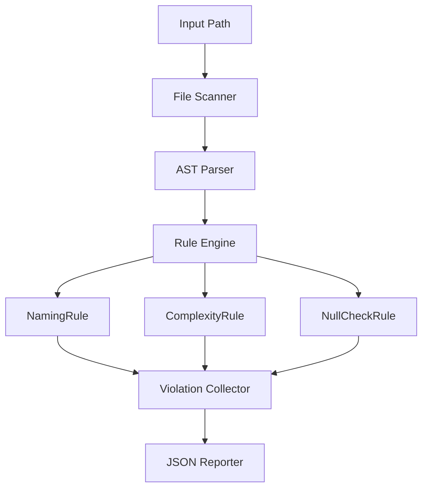

# Data Flow

## Execution

The tool is executed using:

`java -jar target/bytecode-cfg-runner.jar /path/to/java/project`


When executed, the system performs static analysis on the provided Java project and outputs a structured JSON report.

---

## Processing Pipeline

### 1. File Discovery

- The provided directory path is scanned recursively  
- All `.java` source files are identified and collected for analysis  

---

### 2. Parsing

- Each `.java` file is parsed into an Abstract Syntax Tree (AST)  
- The AST represents structural elements such as:
  - Classes
  - Methods
  - Variables
  - Control structures  

---

### 3. Rule Execution

Each file is processed through a set of predefined analysis rules:

#### NamingRule
- Validates naming conventions for:
  - Classes
  - Methods
  - Variables  
- Flags violations such as incorrect casing or non-standard naming patterns  

#### ComplexityRule
- Computes cyclomatic complexity for each method  
- Flags methods exceeding a defined threshold (default: 10)  

#### NullCheckRule
- Detects potential null dereference scenarios  
- Flags unsafe usage of variables that may not be initialized  

---

### 4. Violation Collection

- All rule violations are aggregated into a centralized structure  
- Each violation contains:
  - Rule name  
  - File name  
  - Line number  
  - Descriptive message  

---

### 5. Output Generation

The final output is a JSON report printed to the terminal:

```json
{
  "totalFiles": 5,
  "totalViolations": 3,
  "violations": [
    {
      "rule": "NamingRule",
      "file": "MyClass.java",
      "line": 12,
      "message": "Method name 'ParseFile' should start with lowercase"
    },
    {
      "rule": "ComplexityRule",
      "file": "AnalyzerEngine.java",
      "line": 34,
      "message": "Method 'run' has complexity of 12, exceeds threshold of 10"
    },
    {
      "rule": "NullCheckRule",
      "file": "Parser.java",
      "line": 8,
      "message": "Possible null dereference on variable 'files'"
    }
  ]
}
```
---

## Data Flow Summary



## Scope (v1.0)

### The current version includes:

- Recursive scanning of Java source files
- AST-based parsing
- Rule-based static analysis
- JSON output in terminal

## Limitations 
- No HTML report generation
- No configuration file support
- No graphical user interface
- No IDE plugin integration
- No Control Flow Graph (CFG) visualization

---
