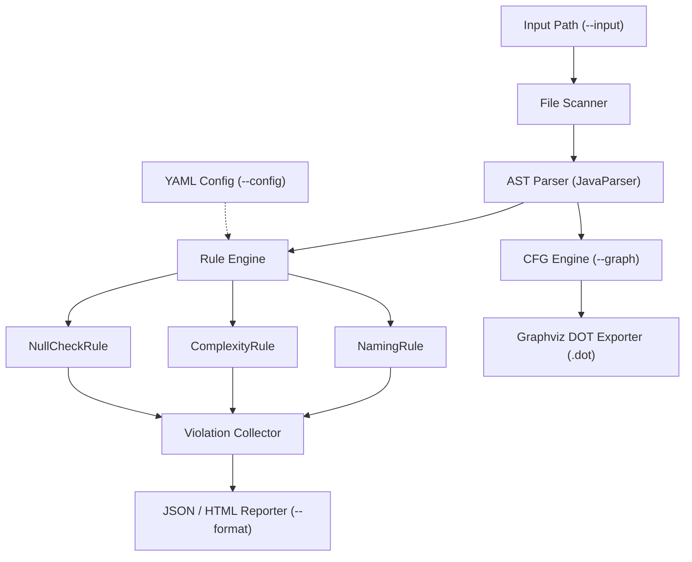

# Data Flow

## Execution

The tool is executed using:
 
```bash
java -jar target/bytecode-cfg-runner.jar --input /path/to/java/project [--format json|html] [--config path/to/config.yml] [--graph path/to/graphs]
```

When executed, the system performs static analysis on the provided Java project and outputs a structured report (JSON or HTML), and optionally exports Control Flow Graph DOT files.

---

## Processing Pipeline

### 1. File Discovery

- The provided directory path is scanned recursively  
- All `.java` source files are identified and collected for analysis  

---

### 2. Parsing

- Each `.java` file is parsed into an Abstract Syntax Tree (AST)  
- The AST represents structural elements such as:
  - Classes
  - Methods
  - Variables
  - Control structures  

---

### 3. Rule Execution

Each file is processed through a set of predefined analysis rules:

#### NamingRule
- Validates naming conventions for:
  - Classes
  - Methods
  - Variables  
- Flags violations such as incorrect casing or non-standard naming patterns  

#### ComplexityRule
- Computes cyclomatic complexity for each method  
- Flags methods exceeding a defined threshold (default: 10)  

#### NullCheckRule
- Detects potential null dereference scenarios  
- Flags unsafe usage of variables that may not be initialized  

---

### 4. Violation Collection

- All rule violations are aggregated into a centralized structure  
- Each violation contains:
  - Rule name  
  - File name  
  - Line number  
  - Descriptive message  

---

### 5. Output Generation

The final output is a JSON report printed to the terminal:

```json
{
  "totalFiles": 5,
  "totalViolations": 3,
  "violations": [
    {
      "rule": "NamingRule",
      "file": "MyClass.java",
      "line": 12,
      "message": "Method name 'ParseFile' should start with lowercase"
    },
    {
      "rule": "ComplexityRule",
      "file": "AnalyzerEngine.java",
      "line": 34,
      "message": "Method 'run' has complexity of 12, exceeds threshold of 10"
    },
    {
      "rule": "NullCheckRule",
      "file": "Parser.java",
      "line": 8,
      "message": "Possible null dereference on variable 'files'"
    }
  ]
}
```
---

## Data Flow Summary


```mermaid
flowchart TD
    A["Input Path (--input)"] --> B["File Scanner"]
    B --> C["AST Parser (JavaParser)"]
    C --> D["Rule Engine"]
    CFG_CFG["YAML Config (--config)"] -.-> D
    D --> D1["NamingRule"]
    D --> D2["ComplexityRule"]
    D --> D3["NullCheckRule"]
    D1 --> E["Violation Collector"]
    D2 --> E
    D3 --> E
    E --> F["JSON / HTML Reporter (--format)"]
    C --> G["CFG Engine (--graph)"]
    G --> H["Graphviz DOT Exporter (.dot)"]
```

## Current Capabilities

- Recursive scanning of Java source files (`--input`)
- JavaParser AST-based parsing and analysis
- Rule-based static analysis (`NamingRule`, `ComplexityRule`, `NullCheckRule`)
- Configurable rules via YAML configuration file (`--config`)
- Structured JSON and styled HTML report generation (`--format json|html`, `--output`)
- Intra-procedural Control Flow Graph (CFG) generation in Graphviz DOT format (`--graph`)

## Current Limitations
- Operates on Java source files (`.java`), not compiled bytecode (`.class`/`.jar`)
- CFGs do not currently model exception control flow (`try`/`catch`/`finally`/`throw`), `switch` branching, or lambda expressions
- Direct visual rendering (e.g. PNG/SVG) requires external Graphviz `dot` executable
- No graphical user interface (GUI) or IDE plugin integration

---
